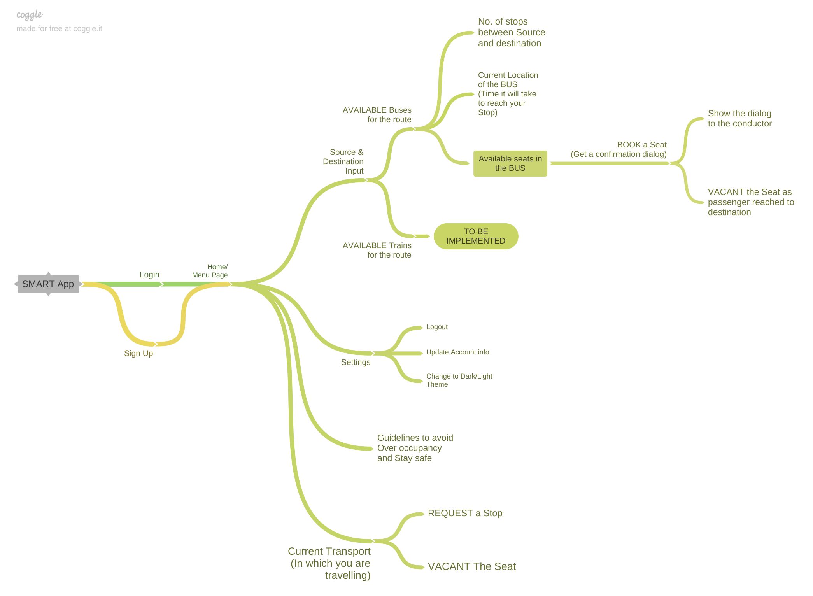

# IBM-Hack-Challenge-2020

## Solution for IBM Hack challenge 2020

## General description:

An app to control overoccupancy in public transport post COVID-19. Timetable/schedule of the buses for the ease of passengers will be provided. Passengers will have to book their seats from the app in order to travel as there will be limited no. of seats.

### Working of the App

- Users will choose the source and destination location in the app.
- They will be presented with different transport options like BUSES and TRAINS ( To be implemented ).
- Users will see the list of BUSES connecting source and destination through different routes.
- They can choose the BUS as per their convenience.
- After choosing the BUS they will be presented with the Route Map of that BUS.
- Users can see the current location of BUS ( On which stop BUS is currently present ) and time taken by it to REACH their STOP.
- Users then will be provided with "BOOK A SEAT" button and they can view the Seat Map of the BUS with VACANT and OCCUPIED seats.
- After booking a SEAT they will get a confirmation dialog.
- Users will have to show that dialog to conductor/driver of the BUS for their successful entry.
- The App will automatically update the seat as VACANT as soon as users will reach their destination.
- Additionally users can request for a stop.

### Additional features of the App (Admin's Pannel)

- There will be a different app for Admins ( Conductor and Drivers of BUSES )
- Admins can mark the seat as VACANT if a person booked a seat and doesn't appear on the STOP.
- They can mark a seat as VACANT if a passenger depart on middle of his/her journey.
- They can mark a SEAT as OCCUPIED if in case a person couldn't book a seat somehow and he/she needs one in the BUS ( provided there are already VACANT seats present in the BUS ).

 
## Novelty / Uniqueness:
The App will provide so many features but in intial phase there will be following features:- 

- Uniquness of the solution lies in the fact that only limited no. of users will be able to book the seats in the BUS ( as the app will reflect limited no. of seats only ) and entry in the BUSES will be allowed only if a person has booked a seat in the app successfully. This will avoid any kind of over-occupancy in the Transport.

- We can also use Bluetooth of devices of passengers in the BUSES/TRAINS or at BUS/RAILWAY Stations to calculate the distance between devices and can send a PUSH notification or an alert to users if they cross a minimum threshold distance.
 
## Business / Social Impact:

The proposed solution will be able to monitor the number of passengers in a bus (maintaining social distancing).The given schedule of each bus timing will prove to be beneficial for people to plan their journey in advance. From the business point of view, there will be a high demand in the rise of number of buses since the number of passengers in each bus will be reduced. Also there will be hike in fare of buses (as less no. of passengers will be travelling)  And, on the social front, the app will come handy in everyday use since it will keep a check on overoccupancy and social distancing.

 
## Technology Stack:

Architectural flow of the proposed solution.

 
## Scope of Work:

The idea is to make ease of transportaton Post-Lockdown and our app try all it's best to 
make it possible.

### Timeline:-
The first phase(base version) require the time of almost 20-25 day to make the beta tester of the App.
In the initial phase there will some limited feature by time we will add some features and effieciency to the app.

The App can be more user-friendly and improvements in the user-interfaces will be made!

